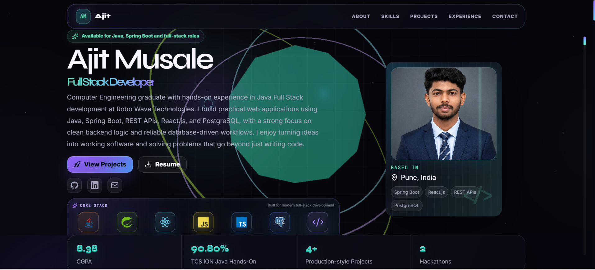
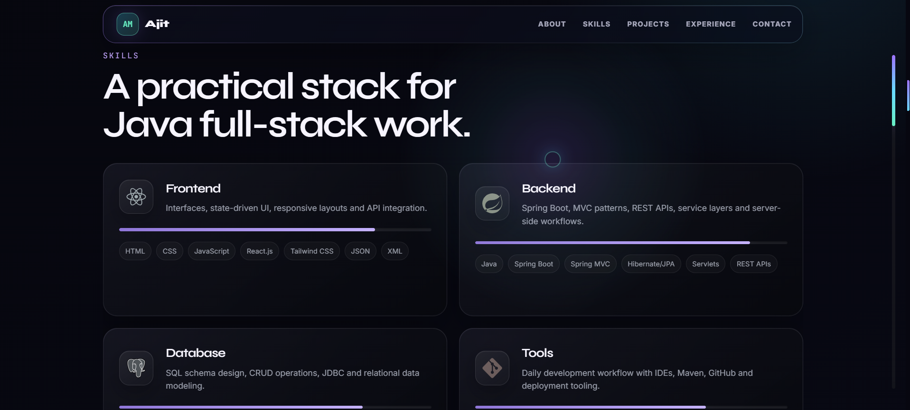
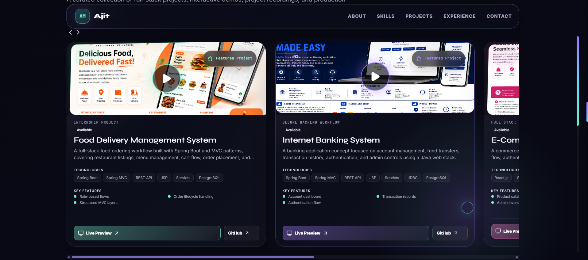
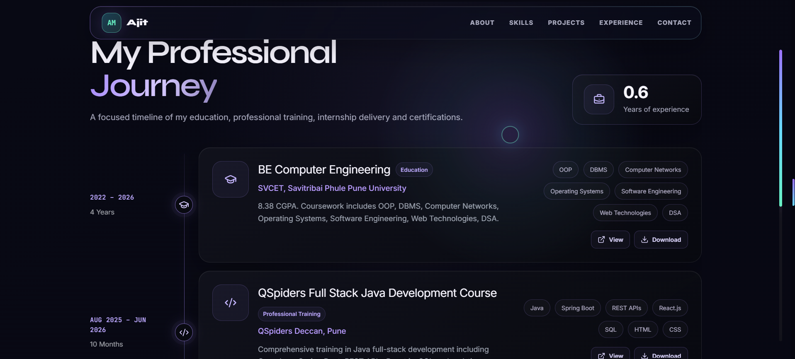
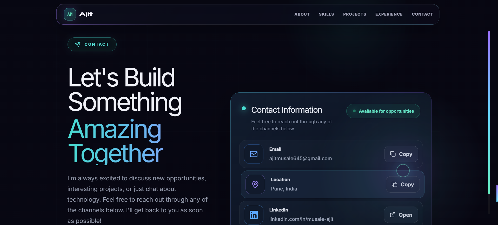

# Ajit Musale | Full Stack Developer Portfolio

A personal developer portfolio built with React and Vite — an animated, single-page dashboard that presents my profile, skills, projects, work experience, certifications, and a working contact form.

**Live Demo:** [https://ajit-portfolio-dev.netlify.app]



---

## About This Project

This is my personal portfolio site, designed to give recruiters and collaborators a quick, visual snapshot of who I am as a developer — a Computer Engineering graduate with hands-on Java Full Stack experience (Spring Boot, REST APIs, React.js, PostgreSQL) gained during my internship at Robo Waves Technologies.

Instead of a static resume page, the site is built as an interactive scroll-driven experience with animated sections, a 3D/tech-logo hero scene, and a functional contact form — all in a single React application.

---

## Features

- **Animated Hero Section** – introduces my role, tech focus, and quick stats (CGPA, certifications, projects completed)
- **Skills Overview** – categorized skill groups (Frontend, Backend, Database, Tools, Core Concepts) with proficiency indicators
- **Project Showcase** – detailed project cards with tech stack, role, description, and live/demo links
- **Experience Timeline** – internship and work history with responsibilities and tech used
- **Education & Certifications** – academic background and verified certificates (e.g., TCS iON NQT Java Hands-On Assessment)
- **Contact Section** – working contact form powered by EmailJS, plus direct social/email links
- **Smooth Scroll Animations** – built with Framer Motion and GSAP ScrollTrigger for section reveals
- **Fully Responsive** – optimized layout across desktop, tablet, and mobile

---

## Tech Stack

| Category | Technology |
|---|---|
| Frontend Library | React.js |
| Build Tool | Vite |
| Styling | Tailwind CSS / Custom CSS |
| Animation | Framer Motion, GSAP (ScrollTrigger) |
| Icons | Lucide React |
| Contact Form | EmailJS |
| Deployment | Vercel |

---

## Project Structure

```
portfolio/
├── public/
│   ├── assets/
│   └── favicon.svg
├── src/
│   ├── assets/              # images, hero graphics
│   ├── components/
│   │   ├── HeroScene.jsx
│   │   └── TechLogoScene.jsx
│   ├── data/
│   │   └── portfolio.js     # all content: profile, skills, projects, experience, etc.
│   ├── App.jsx
│   ├── main.jsx
│   └── styles.css
├── screenshots/              # README preview images (see below)
├── .env.example
├── package.json
└── README.md
```

---

## Getting Started

### Prerequisites
- Node.js (v18 or higher recommended)
- npm

### Installation

```bash
# Clone the repository
git clone https://github.com/ajitmusale3505/portfolio.git

# Move into the project folder
cd portfolio

# Install dependencies
npm install
```

### Environment Variables

This project uses [EmailJS](https://www.emailjs.com/) to power the contact form. Copy the example env file and add your own EmailJS credentials:

```bash
cp .env.example .env
```

```
VITE_EMAILJS_SERVICE_ID=your_service_id
VITE_EMAILJS_TEMPLATE_ID=your_template_id
VITE_EMAILJS_PUBLIC_KEY=your_public_key
```

### Run Locally

```bash
npm run dev
```

The app will be available at `http://localhost:5173`.

### Build for Production

```bash
npm run build
```

---

## Screenshots

| About | Skills |
|---|---|
|  |  |

| Projects | Experience |
|---|---|
|  |  |

| Contact |
|---|
|  |

---

## Roadmap

- [ ] Add dark/light theme toggle
- [ ] Add blog/writing section
- [ ] Improve Lighthouse performance score
- [ ] Add unit tests for form validation

---

## Connect With Me

- **Portfolio:** [Add your deployed link]
- **GitHub:** [github.com/ajitmusale3505](https://github.com/ajitmusale3505)
- **LinkedIn:** [linkedin.com/in/musale-ajit](https://www.linkedin.com/in/musale-ajit/)
- **Email:** ajitmusale645@gmail.com

---

## License

This project is open for reference and learning purposes. If you reuse parts of the code or structure, a credit/link back is appreciated.
